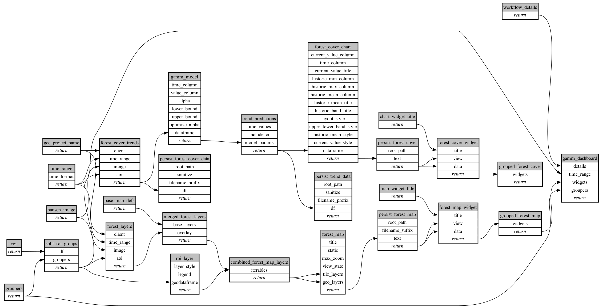

```
# AUTOGENERATED BY ECOSCOPE-WORKFLOWS; see fingerprint in README.md for details

```

```yaml
# fingerprint:
artifacts_sha256_basic: 7980a814d61d349dc6829ccc53d9f61aa16a5c66b808e5d4ae032f0bae1c0ddf
artifacts_sha256_strict: 8943a17fe82ea5312a898d4aac54e81262b079f6fffbd11bd61f1c0cb21747ba
installed_requirements:
- channel: https://repo.prefix.dev/ecoscope-workflows/
  name: ecoscope-workflows-core
  version: {version: ==0.22.16}
- channel: https://repo.prefix.dev/ecoscope-workflows/
  name: ecoscope-workflows-ext-ecoscope
  version: {version: ==0.22.16}
- channel: https://repo.prefix.dev/ecoscope-workflows-custom/
  name: ecoscope-workflows-ext-custom
  version: {version: ==0.0.41}
- channel: file:///tmp/ecoscope-workflows-custom/release/artifacts/
  name: ecoscope-workflows-ext-gamm-trend-analysis
  version: {version: ==0.0.1.dev4+g7fd4762ad.d20260406}
params_sha256: f9b96ac6c0e1bfca4555d1afd61fd9ff01b7273c5e3026c15fde9125c289c5cf
spec_sha256: e8f33639360af6d52499e23e477bdc8894fc1c037283946bb575a806a90c7bdc

```

# ecoscope-workflows-deforestation-workflow


