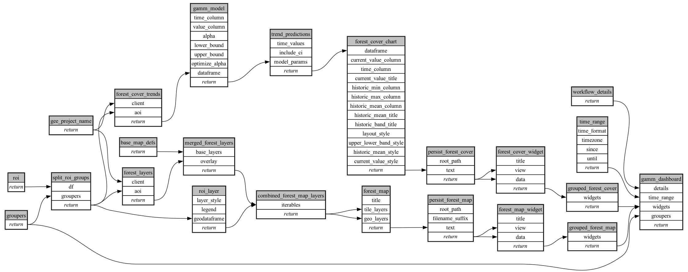

```
# AUTOGENERATED BY ECOSCOPE-WORKFLOWS; see fingerprint in README.md for details

```

```yaml
# fingerprint:
artifacts_sha256_basic: 18f0c2d9c1e081d0c9d16603851951d67e168ad14bf9b38ad2367ed186571f8b
artifacts_sha256_strict: 6435de86d98e155c5cbcee10fd57fe1188064407b6c96934b402098311a245ae
installed_requirements:
- channel: https://repo.prefix.dev/ecoscope-workflows/
  name: ecoscope-workflows-core
  version: {version: ==0.22.16}
- channel: https://repo.prefix.dev/ecoscope-workflows/
  name: ecoscope-workflows-ext-ecoscope
  version: {version: ==0.22.16}
- channel: https://repo.prefix.dev/ecoscope-workflows-custom/
  name: ecoscope-workflows-ext-custom
  version: {version: ==0.0.41}
- channel: https://repo.prefix.dev/ecoscope-workflows-custom/
  name: ecoscope-workflows-ext-gamm-trend-analysis
  version: {version: ==0.0.1}
params_sha256: 85f590b4f4ae55806e454c1130c08ba6a2a16d98cf25b2d23e9a37551141f903
spec_sha256: 3d00e802cfdbed50a587fba59322fcb31ee9f18c94d956fa6efa930202e185c4

```

# ecoscope-workflows-deforestation-workflow


